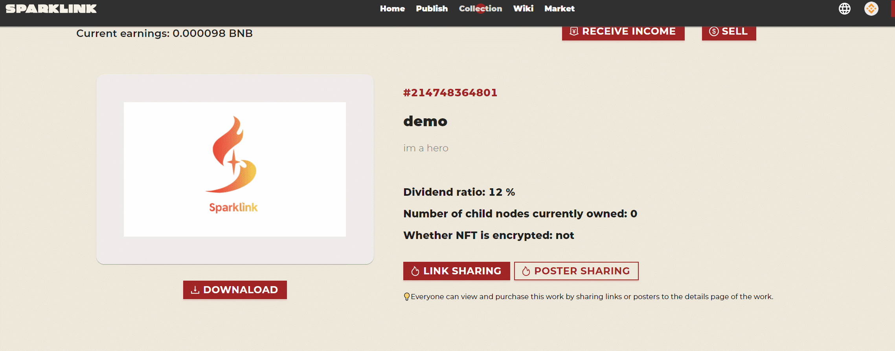

# Share works

egarding how to share, take the following works as an example:

Sharing methods can be divided into link sharing and poster sharing\
\

 (1) (1) (1).png>)

Link sharing: After clicking the link to share, generate and copy the sharing link to the pasteboard, click on the link to enter and view your work information

/pic

After clicking the link to enter, you can see all the information of the work.

Poster sharing: After clicking on the poster to share, a shared poster will be generated, and the poster can be shared with others in any way, as shown in the figure below

After scanning the QR code on the poster to enter, you can see all the information of the work.
